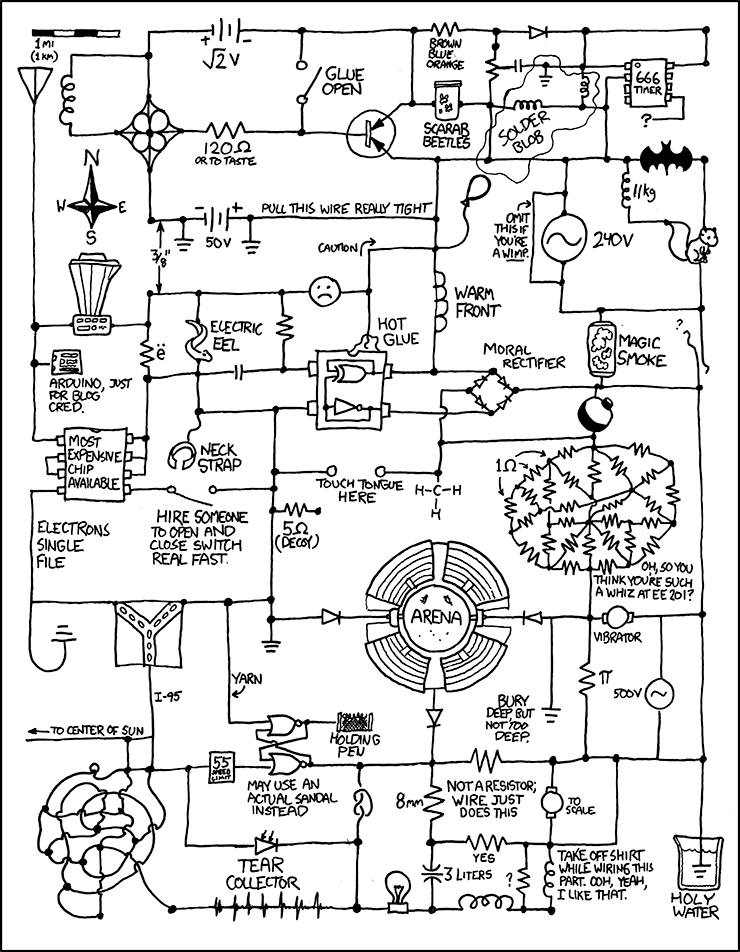
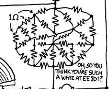
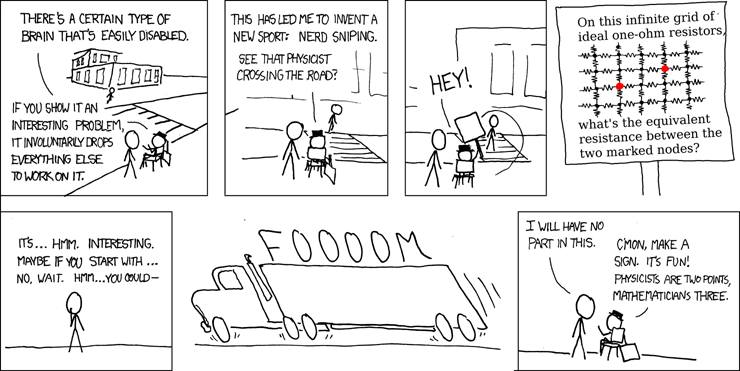

# 🎉 Comic Inspired Equivalent Resistance Problem 🥳

Author: Shaun Harker

Date: 2023-05-01

Note: I had GPT-4 make all the annoying emojis. You're welcome.

## Introduction

I saw the following cartoon on a [Facebook Post](https://www.facebook.com/runatka.cl/posts/pfbid0ywDnEPxxVDeBTqjctMmcrwn18y6ShNHa2D3mtHDTxEwam57RUkyhKyxa7jQHCZS4l):




## The Problem

🔍 _Zoom In!_ 🔍



Of course, as a puzzle-lover, I **HAD** to solve this equivalent resistance problem! 🤓🧩

## Solution technique

### _Extract the graph!_ 💡
First, I grabbed a pen and drew the graph. Then I numbered all the junctions, and wrote down pairs (i, j) whenever there was a resistor between junction i and junction j, for 1 <= i < j <= 15. Well, actually I wrote the i and a list of the j's to save space, but you get the idea. (In retrospect, I should have started indexing at 0. Get ready for a lot of annoying -1's in the matrix indexing!)

### _Kirchoff's law and Ohm's law!_ 💡

1. Apply Kirchoff's law of currents at each node.

This gives a set of linear equations for the current on each edge.

```python
all( sum( C[i,j] for j in outedges(i) ) == 0 for i in [1,2,3,4,5,6,7,8,9,10,11,12,13])
```

2. Apply Ohm's law at each resistor.

The voltage difference across every resistor show obey V[i] - V[j] = C[i,j]

3. Impose `V[1] == 0` and `V[5] == 1`.

We can immediately combine (1) and (2) to obtain linear equations on the V[i]. We no longer need to consider the C[i,j].

This gives one conservation equation for each node (except for 1 and 5).

We include the two additional equations `V[1] = 0` and `V[5] == 1` and then sum up the voltage differences around node `1` in order to get the answer!

### _Solve the linear system!_ 💡

Now we write `A * V = b` where `A` and `b` are the matrix-vector combination that makes this system give the set of relations above, and solve for `V`!

### _Sum the voltage differences around either the source or sink node!_ 💡

Having done this, we can just add up the voltage differences around the source node `1`. Since these are one ohm resistors, we see these are the same values as the current. Sum those currents! Now that gives the total current leaving the source, which must all end up at the sink (we could have done the same trick around the sink). Thus, since there is a one volt difference, we can give the equivalent resistance by taking the reciprocal (since `1 Volt = IR`, we get `R = 1/I`) of this sum. Presto, there you have it!

## 💻 Coding it up with GPT-4 🚀

Now all that's left to do is write code that handles this. I gave GPT-4 the above discussion and edited its output to give this solution:

```python
import numpy as np
from scipy.linalg import solve

# Graph structure
graph = {
    1: [2, 9, 10, 11],
    2: [3, 11],
    3: [4, 11, 12],
    4: [5, 12, 13],
    5: [6, 13],
    6: [7, 13, 14],
    7: [8, 15],
    8: [9, 15],
    9: [10, 14],
    10: [13],
    11: [13, 15],
    12: [13],
    13: [14],
    14: [],
    15: []
}

# Create the A matrix
A = np.zeros((15, 15))

node_count = len(graph)
for node, neighbors in graph.items():
    if node not in [1, 5]:
        A[node - 1, node - 1] += len(neighbors)
        for neighbor in neighbors:
            A[node - 1, neighbor - 1] = -1
            if neighbor not in [1, 5]:
                A[neighbor - 1, neighbor - 1] += 1
                A[neighbor - 1, node - 1] = -1
    elif node in [1, 5]:
        A[node - 1, node - 1] = 1
        for neighbor in neighbors:
            A[neighbor - 1, neighbor - 1] += 1
            A[neighbor - 1, node - 1] = -1
            
# Create the B matrix, where B[n] = V[n + 1] - V[n]
B = np.zeros((15, 1))
B[4] = 1

print(A)
print(B)

# Solve the linear system of equations
V = solve(A, B)

print(V)

# Calculate the effective resistance between nodes 1 and 5
R_effective = 1 / (V[2] + V[3] + V[8])

print("The effective resistance between nodes 1 and 5 is approximately: {:.4f} ohms.".format(R_effective[0]))
```

When run, this gives the output of

```bash
[[ 1.  0.  0.  0.  0.  0.  0.  0.  0.  0.  0.  0.  0.  0.  0.]
 [-1.  3. -1.  0.  0.  0.  0.  0.  0.  0. -1.  0.  0.  0.  0.]
 [ 0. -1.  4. -1.  0.  0.  0.  0.  0.  0. -1. -1.  0.  0.  0.]
 [ 0.  0. -1.  4. -1.  0.  0.  0.  0.  0.  0. -1. -1.  0.  0.]
 [ 0.  0.  0.  0.  1.  0.  0.  0.  0.  0.  0.  0.  0.  0.  0.]
 [ 0.  0.  0.  0. -1.  4. -1.  0.  0.  0.  0.  0. -1. -1.  0.]
 [ 0.  0.  0.  0.  0. -1.  3. -1.  0.  0.  0.  0.  0.  0. -1.]
 [ 0.  0.  0.  0.  0.  0. -1.  3. -1.  0.  0.  0.  0.  0. -1.]
 [-1.  0.  0.  0.  0.  0.  0. -1.  4. -1.  0.  0.  0. -1.  0.]
 [-1.  0.  0.  0.  0.  0.  0.  0. -1.  3.  0.  0. -1.  0.  0.]
 [-1. -1. -1.  0.  0.  0.  0.  0.  0.  0.  5.  0. -1.  0. -1.]
 [ 0.  0. -1. -1.  0.  0.  0.  0.  0.  0.  0.  3. -1.  0.  0.]
 [ 0.  0.  0. -1. -1. -1.  0.  0.  0. -1. -1. -1.  7. -1.  0.]
 [ 0.  0.  0.  0.  0. -1.  0.  0. -1.  0.  0.  0. -1.  3.  0.]
 [ 0.  0.  0.  0.  0.  0. -1. -1.  0.  0. -1.  0.  0.  0.  3.]]
[[0.]
 [0.]
 [0.]
 [0.]
 [1.]
 [0.]
 [0.]
 [0.]
 [0.]
 [0.]
 [0.]
 [0.]
 [0.]
 [0.]
 [0.]]
[[0.        ]
 [0.25902901]
 [0.44460052]
 [0.63861625]
 [1.        ]
 [0.63222232]
 [0.47214285]
 [0.38699734]
 [0.29164027]
 [0.28441148]
 [0.33248652]
 [0.54827031]
 [0.56159416]
 [0.49515225]
 [0.39720891]]
The effective resistance between nodes 1 and 5 is approximately: 0.7273 ohms.
```

So there you have it! For a problem that GPT-4 is only hazily aware of some of the techniques involved, try this xkcd comic:


